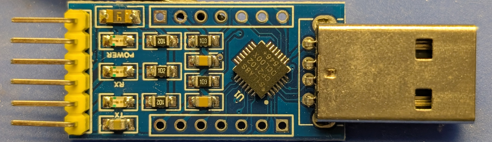
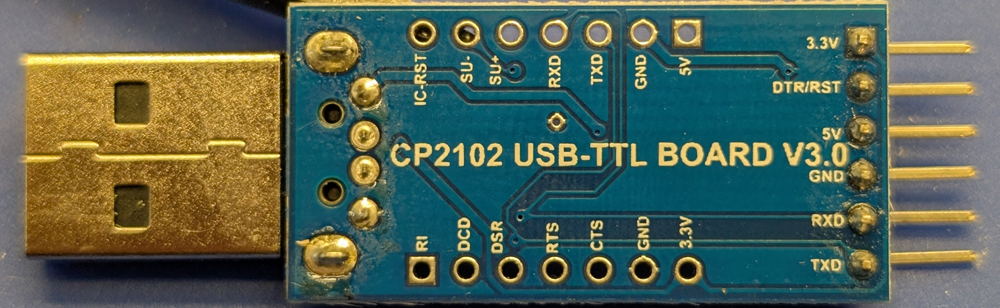
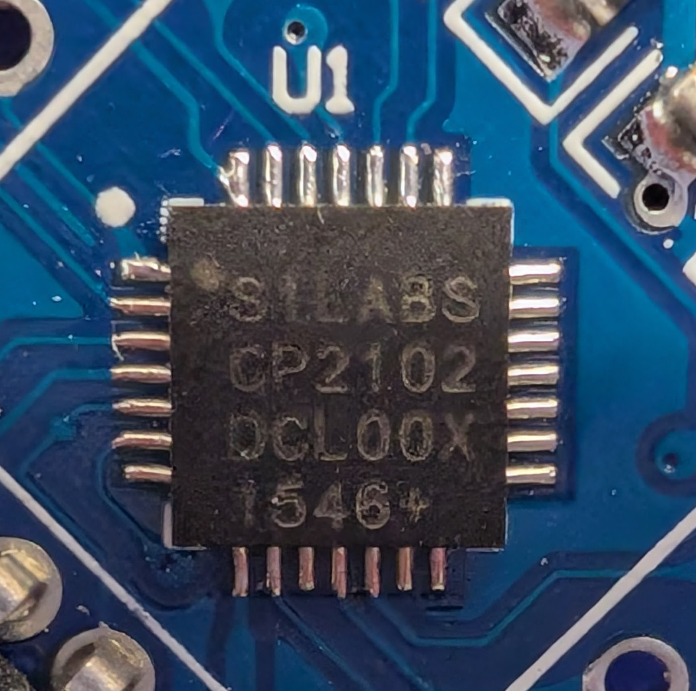

# CP2102 USB-TTL BOARD V3.0

This is documentation of a tool, not a take-apart project.

The board has no brand, and its original [product page](https://www.amazon.com/dp/B00SL0U3RG)
is no longer available on Amazon.com.

## Board





Markings:

```text
CP2102 USB-TTL BOARD V3.0
```

### Left Port

Left port, as viewed from the bottom side of the board,
with USB port in the 12 o'clock position. 

The square pad is pin 1.

| Pin | Label |
|-----|-------|
| 1   | RI    |
| 2   | DCD   |
| 3   | DSR   |
| 4   | RTS   |
| 5   | CTS   |
| 6   | GND   |
| 7   | 3.3V  |

### Bottom Port

Bottom port, as viewed from the bottom side of the board,
opposite USB port.

The square pad is pin 1.

| Pin | Label   |
|-----|---------|
| 1   | 3.3V    |
| 2   | DTR/RST |
| 3   | 5V      |
| 4   | GND     |
| 5   | RXD     |
| 6   | TXD     |

### Right Port

Right port, as viewed from the bottom side of the board,
with USB port in the 12 o'clock position.

The square pad is pin 1.

| Pin | Label  |
|-----|--------|
| 1   | 5V     |
| 2   | GND    |
| 3   | TXD    |
| 4   | RXD    |
| 5   | SU+    |
| 6   | SU-    |
| 7   | IC-RST |

### Silicon Labs CP2102



Package: QFN-28

Markings:

```text
SILABS
CP2102
DCL00X
1546+
```

[Manufacturer page](https://www.silabs.com/interface/usb-bridges/classic/device.cp2102)

[Datasheet](https://www.silabs.com/documents/public/data-sheets/CP2102-9.pdf)

Description:
* Integrated USB full speed (12 Mbps)
* UART:
  * 300 bps - 1 Mbps
  * 576-byte RX buffer, 640-byte TX buffer
* Self-powered 3.3V (3.0 - 3.6 V), bus-powered 5V
* There are direct APIs available:
  * [Manufacturer doc](https://www.silabs.com/documents/public/application-notes/an223.pdf)
  * Supported via USBXpress™ Direct Driver on Windows
  * cp210x Linux driver
  * Only the CP2102**N** chip offers GPIO.
This "classic" chip doesn't do GPIO.

I'm surprised that this chip has onboard EEPROM. Cool.
